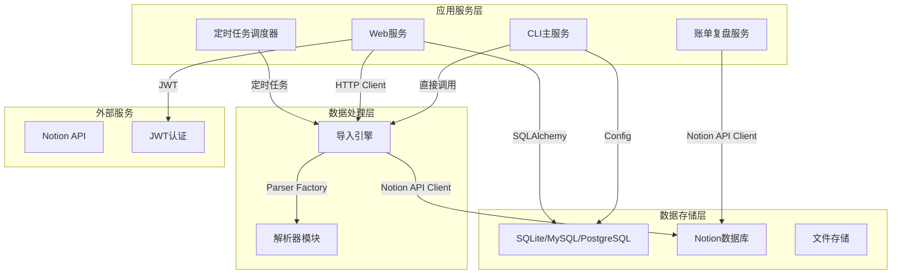
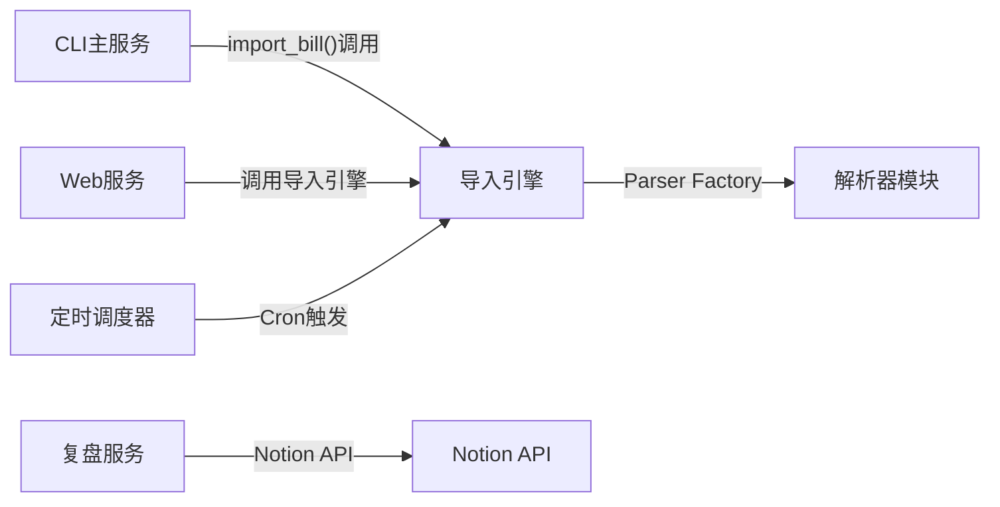
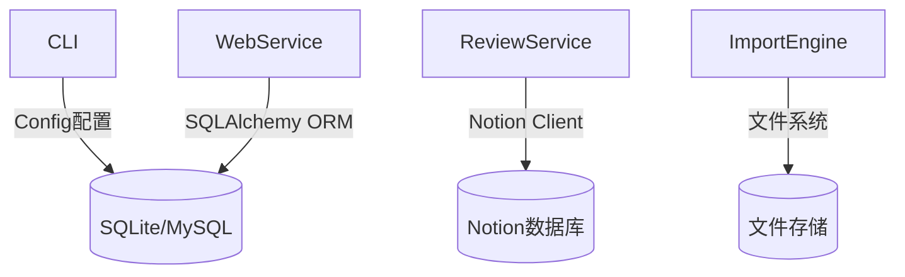

# Import_Bill_To_Notion - 仓库依赖关系

> 基于代码中的依赖调用分析生成。

## 基本信息

- **分析版本**: `31bdfeb5925ad32018c28eb89718da9239f86366`
- **生成时间**: 2026-03-04

## 整体依赖拓扑

### 服务间调用关系

### 数据存储依赖

## 依赖详细说明

### 服务间依赖

#### CLI主服务 依赖

| 被依赖服务 | 依赖类型 | 调用方式 | 代码位置 | 强度 |
|-----------|---------|---------|---------|------|
| 导入引擎 | 内部模块 | 直接函数调用 | `Import_Bill_To_Notion/src/main.py:9` | 强 |
| 定时调度器 | 内部模块 | 条件导入调用 | `Import_Bill_To_Notion/src/main.py:46` | 弱 |
| 复盘服务 | 内部模块 | 直接函数调用 | `Import_Bill_To_Notion/src/main.py:36` | 弱 |
| 配置管理 | 内部模块 | 模块导入 | `Import_Bill_To_Notion/src/main.py:7-8` | 强 |

#### Web服务 依赖

| 被依赖服务 | 依赖类型 | 调用方式 | 代码位置 | 强度 |
|-----------|---------|---------|---------|------|
| 导入引擎 | 内部模块 | 函数调用 | `Import_Bill_To_Notion/web_service/routes/upload.py:25` | 强 |
| 数据库服务 | 内部模块 | ORM连接 | `Import_Bill_To_Notion/src/services/database.py:4` | 强 |
| 认证模块 | 内部模块 | JWT验证 | `Import_Bill_To_Notion/src/auth.py` | 强 |
| 文件服务 | 内部模块 | 服务调用 | `Import_Bill_To_Notion/web_service/services/file_service.py` | 强 |
| 用户服务 | 内部模块 | 业务逻辑 | `Import_Bill_To_Notion/src/models.py` | 强 |

#### 定时调度器 依赖

| 被依赖服务 | 依赖类型 | 调用方式 | 代码位置 | 强度 |
|-----------|---------|---------|---------|------|
| APScheduler | 外部库 | 直接实例化 | `Import_Bill_To_Notion/src/scheduler.py:3-4` | 强 |
| 导入引擎 | 内部模块 | 任务函数调用 | `Import_Bill_To_Notion/src/scheduler.py:6` | 强 |
| 配置管理 | 内部模块 | 配置读取 | `Import_Bill_To_Notion/src/scheduler.py:5` | 强 |

### 数据存储依赖

| 存储服务 | 使用模块 | Client 类型 | 代码位置 | 用途 |
|---------|---------|------------|---------|------|
| SQLite/MySQL/PostgreSQL | Web服务 | SQLAlchemy | `Import_Bill_To_Notion/src/services/database.py:4-6` | 用户数据存储 |
| Notion数据库 | 导入引擎 | Notion Client | `Import_Bill_To_Notion/src/notion_api.py:3` | 账单数据存储 |
| Notion数据库 | 复盘服务 | Notion Client | `Import_Bill_To_Notion/src/review_service.py:10` | 复盘报告存储 |
| 文件系统 | 文件服务 | OS API | `Import_Bill_To_Notion/web_service/services/file_service.py:17-21` | 文件存储 |

### 外部服务依赖

| 服务名称 | 使用模块 | 用途 | 代码位置 |
|---------|---------|------|---------|
| Notion API | 导入引擎 | 创建数据库页面 | `Import_Bill_To_Notion/src/notion_api.py:3` |
| Notion API | 复盘服务 | 读取和写入报告 | `Import_Bill_To_Notion/src/review_service.py:10` |
| JWT认证 | 认证模块 | 用户身份验证 | `Import_Bill_To_Notion/src/auth.py:5` |
| bcrypt | 认证模块 | 密码加密 | `Import_Bill_To_Notion/src/auth.py:6` |

### 消息队列依赖

| 模块 | 角色 | Topic | 代码位置 |
|-----|------|-------|---------|
| APScheduler | Producer | Cron定时任务 | `Import_Bill_To_Notion/src/scheduler.py:28-34` |

## 依赖统计

| 服务名称 | 依赖服务数 | 被依赖次数 | 数据库数 | 外部服务数 |
|---------|-----------|-----------|---------|-----------|
| CLI主服务 | 4 | 0 | 0 | 0 |
| Web服务 | 5 | 0 | 1 | 1 |
| 定时调度器 | 2 | 0 | 0 | 1 |
| 导入引擎 | 3 | 3 | 1 | 1 |
| 复盘服务 | 1 | 0 | 1 | 1 |

---

> 📊 共分析 6 个服务，识别 15 个依赖关系。

---

## 注意事项

1. **基于 Client 代码**：必须通过扫描实际的 client 调用来识别依赖
2. **代码位置标注**：为每个依赖关系标注具体的代码文件和行号
3. **路径规范**：代码位置使用相对路径格式 `项目目录/文件路径:行号`。**必须**使用任务上下文中提供的 `项目目录` 值作为路径前缀，不要使用绝对路径，也不要省略项目目录前缀
4. **Mermaid 图清晰**：图不要过于复杂，必要时分多个图展示
5. **区分强弱依赖**：根据业务逻辑判断依赖强度
6. **识别循环依赖**：如发现循环依赖必须标记
7. **统计信息准确**: 提供准确的依赖数量统计
8. **避免冗余原则**:
   - 只列依赖关系，不详述内部模块结构
   - 代码示例只标注位置（file:line），不展示完整代码片段
   - 依赖详情用表格形式，保持简洁
   - 不包含详细的架构分层图（架构图在仓库架构.md）
9. **执行原则**: 你的上下文窗口会在接近限制时自动被压缩，因此不要因为Token预算问题提前停止任务，即使预算快用完，也要尽可能完整执行任务。
